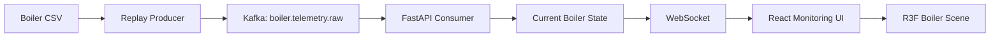

# BoilerOps Agent 프로젝트 계획

## 1. 프로젝트 식별 정보

| 항목 | 값 |
| --- | --- |
| 프로젝트명 | BoilerOps Agent |
| 한줄 설명 | 한국중부발전 보일러 운전데이터를 실시간 스트림으로 재현하고, 2.5D 보일러 모니터링·운전 분석·AI Agent·승인 기반 제어까지 단계적으로 검증하는 산업 운영 시스템 |
| 디렉토리명 | `boiler-ops-agent` |
| GitHub Repository | `boiler-ops-agent` |
| Frontend | React + TypeScript + Vite + React Three Fiber |
| Backend | FastAPI |
| Event Streaming | Apache Kafka |
| Browser Streaming | WebSocket |
| 원본 데이터 | `한국중부발전(주)_(AI 친화 데이터)분 단위 발전설비(보일러) 운전데이터_20250404.csv` |
| 데이터 제공기관 | 한국중부발전(주) |
| 데이터 출처 | 공공데이터포털 |
| 현재 진행 상태 | Phase 1~7 구현 및 로컬 통합 E2E 검증 완료 |

## 2. 프로젝트 목표

BoilerOps Agent는 정적인 분 단위 발전설비 데이터를 시간 순서대로 재생해 실시간 보일러 운전 환경을 구성한다.

첫 목표는 AI 기능이 아니다. CSV 한 행이 Event로 발행되고, Kafka와 FastAPI를 거쳐 WebSocket으로 React 화면에 전달되며, 사용자가 보일러 계통·설비·Sensor 값을 시간 순서대로 확인할 수 있는 상태를 먼저 만든다.

Phase 1의 화면은 일반적인 카드·테이블 중심 산업 Dashboard가 아니라 **고정형 2.5D Isometric Boiler Operations View**를 중심으로 구성한다.

```text
Plant Overview
        ↓
Equipment
        ↓
Sensor
        ↓
Current Value / Trend
```

3D는 장식이 아니다.

> 이 값이 보일러 어느 계통에서 발생하는지 빠르게 이해하기 위한 Monitoring Navigation Layer

로 사용한다.

실시간 데이터 흐름과 보일러 도메인 모델이 검증된 뒤 운전 분석, Read-only AI Agent, 온도 예측·제어 권고, 승인 기반 Simulator 제어를 단계적으로 추가한다.

```text
Historical Boiler CSV
        ↓
Realtime Replay Producer
        ↓
Apache Kafka
        ↓
FastAPI Operations Backend
        ↓
WebSocket
        ↓
React Monitoring UI
        ↓
React Three Fiber Boiler View
        ↓
Operational Analysis
        ↓
AI Operations Agent
        ↓
Control Recommendation
        ↓
Human Approval
        ↓
Simulator Control
        ↓
Trace / Validation
```

## 3. 문제 정의

발전 보일러 운전데이터에는 출력, 급탄, 공기, 급수, 증기, 과열기, 재열기, 배기가스 등 많은 Tag가 동시에 존재한다.

Raw CSV 또는 일반 Table만으로는 값이 어느 계통에 속하는지, 목표값과 실제값이 어떻게 변하는지, 관련 제어값이 함께 어떻게 변했는지 파악하기 어렵다.

설비의 공간적·계통적 관계가 없는 숫자 나열은 사용자가 특정 Sensor와 운전 상태의 관계를 이해하는 데 한계가 있다.

프로젝트는 네 문제를 순서대로 해결한다.

1. 정적 CSV를 검증 가능한 실시간 Event 흐름으로 변환한다.
2. Raw Tag를 보일러 설비·계통·Sensor 문맥으로 구조화한다.
3. 설비와 Sensor Context를 2.5D Operations View에서 탐색할 수 있게 한다.
4. 검증된 운영 데이터를 AI Agent가 Tool을 통해 조회하고, 쓰기 작업에는 승인 경계를 적용한다.

## 4. 데이터 사용 원칙

### 4.1 원본 파일

```text
한국중부발전(주)_(AI 친화 데이터)분 단위 발전설비(보일러) 운전데이터_20250404.csv
```

원본 파일은 저장소에 커밋하지 않는다.

```text
data/raw/*.csv
```

실행 환경에서는 환경 변수로 경로를 주입한다.

```text
BOILER_DATASET_PATH=
REPLAY_INTERVAL_MS=
KAFKA_BOOTSTRAP_SERVERS=
KAFKA_TOPIC=
```

### 4.2 검증 전 확정 금지 항목

원본 파일과 공식 메타데이터를 확인하기 전에는 값을 임의로 확정하지 않는다.

- 측정 단위
- 정상·주의·위험 임계값
- 실제 Sensor 장착 좌표
- DCS/PLC Tag ID
- 설비별 제어 허용 범위
- 고장 Label
- 온도 제어 인과관계

컬럼명으로 확인 가능한 위치는 논리 계통 위치로 사용한다.

실제 발전소 P&ID 또는 Instrument Index가 필요한 위치는 `unverified` 상태로 관리한다.

### 4.3 3D 위치 원칙

React Three Fiber Scene의 `scene_position`은 실제 계측기 설치 좌표가 아니다.

```text
actual physical position
≠
scene_position
```

`scene_position`은 사용자가 보일러 계통을 이해하기 위한 논리적 화면 좌표다.

실제 좌표처럼 보이는 정밀한 위치를 근거 없이 생성하지 않는다.

## 5. Phase 1 이벤트 계약

Phase 1에서는 CSV 원본 행을 그대로 브라우저로 전송하지 않는다.

Replay Producer가 식별 가능한 Event Envelope를 생성한다.

```json
{
  "sequence": 1024,
  "source_time": "<CSV 원본 시각>",
  "emitted_at": "<Replay 발행 시각>",
  "measurements": {
    "<tag>": "<value>"
  }
}
```

필수 규칙:

- `sequence`는 Replay 시작점부터 단조 증가한다.
- `source_time`은 원본 데이터의 시간축을 보존한다.
- `emitted_at`은 Replay 시스템의 발행 시각이다.
- 결측값은 임의 숫자로 대체하지 않는다.
- 숫자 파싱 실패는 원본 값과 오류 정보를 추적 가능하게 남긴다.
- Phase 1 Kafka Topic은 순서 검증을 위해 단일 Partition으로 시작한다.

초기 Topic 이름:

```text
boiler.telemetry.raw
```

## 6. Phase 1 시스템 구조



책임 경계:

| 구성 | 책임 |
| --- | --- |
| Replay Producer | CSV 순차 읽기, Event Envelope 생성, 재생 속도 적용, Kafka 발행 |
| Kafka | Backend 내부 Event 전달, Producer와 Consumer 분리 |
| FastAPI Consumer | Kafka Event 수신, 파싱, 최신 Boiler State 관리 |
| WebSocket | 브라우저 실시간 상태 전달, 연결·재연결 처리 |
| React | KPI, Inspector, Operations Feed, 연결 상태 관리 |
| React Three Fiber | 2.5D Boiler Scene, Equipment, Sensor Marker, 선택 상태 표현 |

Raw Kafka Message를 React에 그대로 전달하지 않는다.

FastAPI가 Parsing과 Domain Mapping을 담당한다.

Frontend는 원본 CSV Column 의미를 독립적으로 재해석하지 않는다.

## 7. 보일러 도메인 초기 분류

현재 제공된 Column Name을 기준으로 논리 계통을 분류한다.

실제 설비의 물리 배치와 동일하다고 주장하지 않는다.

### Generation

- 실제 출력값
- 목표 발전량
- 총 주증기 유량
- 주증기 유량
- 터빈용 주증기 압력

### Fuel / Combustion

- 석탄 유량 제어
- 급탄기 A~F 요구값
- 급탄기 A~F 속도 평균값
- 산소 제어
- 산소농도 기반 보정 제어
- 총 공기 유량
- 2차공기 주제어
- 버너 기울기 관련 값

### Furnace / Waterwall

- 노내 상부 좌측부 튜브 헤더 출구 온도 평균값
- 노내 상부 우측부 튜브 헤더 출구 온도 평균값
- 노내 상부 전면부 튜브 헤더 출구 온도 평균값
- 노내 상부 루프 튜브 헤더 출구 온도 평균값
- 보일러 노 루프 튜브 금속 온도

### Feedwater / Economizer

- 절탄기 입구 급수 보정 유량
- 절탄기 입구 급수 압력 중간값
- 절탄기 입구 급수 온도 중간값
- 절탄기 헤더 출구 링크 온도 01/02
- 총 급수 보정 유량
- 급수 압력 중간값
- 급수 온도 중간값

### Superheater / Main Steam

- 과열기 계통 입·출구 온도
- 최종과열기 헤더 온도 평균값 A/B
- 최종과열기 출구 온도 평균값
- 주증기 압력 관련 값
- 과열기 스프레이 총 유량
- 과열저감기 스프레이 유량·밸브 개도

### Reheater

- 저온 재열기 압력
- 재열증기 과열저감기 입·출구 온도 A/B
- 최종재열기 입구 온도 관련 값
- 재열기 스프레이 유량
- 재열기 과열저감기 스프레이 밸브 개도
- 목표 재열기 온도

### Flue Gas / Environment

- 배기가스 산소 중간값 A/B
- 덕트용 불투명도 분석기 A/B
- 선택적 촉매 환원장치 A/B 배기가스 입구 온도
- 굴뚝용 질소산화물 분석기

## 8. Phase 계획

### Phase 1 — Realtime Boiler Monitoring

**목표**

CSV 한 행이 실시간 Event Pipeline을 통과해 React 화면과 2.5D Boiler Scene에서 순서대로 갱신되는 전체 흐름을 완성한다.

**구현 범위**

- CSV 스키마 확인
- Replay Producer
- 재생 속도 환경 변수
- Kafka 단일 Topic·단일 Partition
- FastAPI Kafka Consumer
- 현재 Boiler State 관리
- WebSocket Endpoint
- React WebSocket 연결·재연결
- React Three Fiber 기본 Scene
- 고정형 Isometric Camera
- 제한된 Zoom / Pan
- 대표 Equipment Geometry
- 대표 KPI
- 검증 가능한 Sensor Marker
- Sensor 선택
- Equipment / Sensor Inspector
- Live Operations Feed
- 연결 상태 표시
- Stale / Error 상태 표시
- WebGL Fallback

**2.5D Boiler Scene 초기 구성**

```text
Feeders
   ↓
Furnace
   ↓
Superheater / Reheater
   ↓
Economizer
   ↓
SCR
   ↓
Stack
```

급수·증기 Flow는 필요 범위에서 별도 Line으로 표현한다.

```text
Feedwater
   ↓
Economizer
   ↓
Furnace / Waterwall
   ↓
Superheater
   ↓
Main Steam
```

근거가 없는 세부 배관은 그리지 않는다.

**대표 KPI 초기 후보**

- 실제 출력값
- 목표 발전량
- 총 주증기 유량
- 터빈용 주증기 압력
- 최종과열기 출구 온도 평균값
- 배기가스 산소 중간값
- 과열기 스프레이 총 유량
- 굴뚝용 질소산화물 분석기

단위는 데이터 정의 확인 후 표시한다.

**완료 기준**

- CSV Row 순서와 Kafka Event `sequence`가 일치한다.
- FastAPI가 Kafka Event를 순서대로 소비한다.
- React가 WebSocket Message 수신 시 현재값을 갱신한다.
- R3F Sensor Marker에 대표 Sensor 값이 반영된다.
- Sensor를 선택하면 Inspector가 동일한 Tag의 최신값을 표시한다.
- Source Time과 Sequence를 화면에서 확인할 수 있다.
- Live Operations Feed에서 최근 Event 진행을 확인할 수 있다.
- Kafka·WebSocket 연결 상태를 화면에서 확인할 수 있다.
- 갱신 중단 시 Stale 상태를 확인할 수 있다.
- WebSocket 연결 종료 후 재연결이 가능하다.
- WebGL 사용 불가 상태에서 Fallback이 표시된다.
- E2E 실행 결과로 재현 가능한 검증 아티팩트가 생성된다.

**Phase 1 제외 범위**

- AI Agent
- 온도 예측 모델
- 이상 탐지 모델
- 자동제어
- Write Tool
- Human Approval
- 실제 발전설비 연결
- 임의 정상·위험 임계값
- 자유 Camera Rotate
- 1인칭 이동
- Cinematic Camera
- 장식 목적 Particle / Glow / Bloom
- 3D 객체 클릭 기반 제어
- 실제 발전소 P&ID 복제
- Digital Twin 표현

---

### Phase 2 — Boiler Domain & Sensor Mapping

**목표**

Raw CSV Column을 설비·계통·측정값 문맥으로 구조화하고 2.5D Scene의 논리 위치와 연결한다.

**구현 범위**

- Tag Registry
- Equipment Hierarchy
- Sensor → Equipment Mapping
- Sensor → Scene Position Mapping
- 공식 근거가 확인된 Unit 반영
- Measurement / Control / Target 구분
- Mapping Confidence 관리
- 센서 선택 시 최근 Trend 표시
- Process Flow 정리
- Related Tag 연결

**Sensor Metadata 최소 구조**

```text
tag
label
equipment
section
measurement_type
unit
mapping_confidence
scene_position
```

**완료 기준**

- 화면에 표시하는 모든 Tag가 Registry에 등록된다.
- Sensor 위치마다 위치 근거 또는 `unverified` 상태가 존재한다.
- 원본 CSV Column과 화면 Sensor 간 역추적이 가능하다.
- Scene에서 선택한 Sensor와 Inspector의 Tag가 일치한다.
- `unverified` Tag가 정밀 Sensor 위치로 표현되지 않는다.

---

### Phase 3 — Operational Monitoring

**목표**

실시간 값 표시를 운전 상태 비교와 변화 추적이 가능한 Monitoring으로 확장한다.

**구현 범위**

- Actual vs Target
- 최근 Trend
- 변화율
- Historical Distribution 기반 Deviation
- 관련 제어값 비교
- 과열기 또는 재열기 중 첫 분석 Loop 선택

**완료 기준**

- 선택한 Loop의 목표값·실제값·관련 입력값을 동일 시간축에서 비교할 수 있다.
- Scene에서 선택한 설비의 관련 운전값을 Inspector에서 확인할 수 있다.
- 공식 기준 없는 임계값을 안전 기준으로 표현하지 않는다.

---

### Phase 4 — Read-only AI Operations Agent

**목표**

AI Agent가 Raw CSV를 직접 읽지 않고 FastAPI의 검증된 Read Tool만 사용해 운전 상태를 설명하도록 구성한다.

**Tool 후보**

```text
get_boiler_status
get_equipment_status
get_sensor_history
get_operating_targets
get_current_controls
get_deviation_summary
```

**완료 기준**

- Agent의 모든 수치 근거가 Tool Result로 추적된다.
- 존재하지 않는 Tag를 근거로 사용하지 않는다.
- Scene에서 선택한 Equipment Context와 Agent 조회 대상이 일치한다.
- Write 기능이 존재하지 않는다.
- Tool 호출과 응답 Trace를 검증할 수 있다.

---

### Phase 5 — Temperature Forecast & Control Advisory

**목표**

선택한 온도 Loop의 미래 상태를 예측하고 운전 권고의 근거로 사용한다.

**진행 순서**

1. 예측 대상과 Forecast Horizon 확정
2. Naive Baseline 측정
3. 학습 모델 적용
4. MAE·RMSE 비교
5. Agent가 예측 결과를 Read Tool로 조회
6. 자동제어가 아닌 Control Advisory 제공

**제약**

관측 데이터에서 확인된 상관관계를 제어 인과관계로 단정하지 않는다.

3D Scene은 예측값을 이해하기 위한 Context를 제공할 수 있지만 제어 실행 UI로 사용하지 않는다.

---

### Phase 6 — Controlled Simulator Write

**목표**

Agent의 제어 제안을 승인된 Simulator 환경에서만 실행한다.

```text
Agent Recommendation
        ↓
Constraint Validation
        ↓
Human Approval
        ↓
Simulator Write
        ↓
Result / Trace
```

**원칙**

- Read Tool은 정책 범위 안에서 자동 실행 가능
- Write Tool은 Human Approval 필수
- 실제 발전설비 제어 연결 금지
- 요청값·기존값·승인 판단·실행 결과·Trace 기록
- 승인 거절 후 실행 금지
- 3D Equipment 클릭만으로 Write 실행 금지

제어 UI는 Scene과 분리한다.

```text
3D Scene
= Monitoring / Selection

Control Panel
= Requested Change / Constraint / Approval
```

---

### Phase 7 — Integrated E2E Validation

**목표**

전체 시스템의 실패 경로와 운영 경계를 E2E로 검증한다.

**검증 범위**

- Kafka 중단·복구
- WebSocket 중단·재연결
- CSV 결측·파싱 실패
- Event 순서 위반 감지
- Tag Mapping 오류
- Sensor Scene Position 오류
- Scene Sensor 값과 Inspector 값 불일치
- WebGL 초기화 실패
- Agent Tool 실패
- 승인 없는 Write 차단
- 승인 거절 후 미실행
- Write Trace 기록

**완료 기준**

```text
Unauthorized Write = 0
Approval Bypass = 0
Rejected Write Execution = 0
Successful Write Trace Coverage = 100%
```

핵심 E2E 시나리오는 검증 가능한 아티팩트를 남긴다.

## 9. 화면 설계 원칙

Phase 1 화면 세부 기준은 `DESIGN.md`를 따른다.

보일러 화면은 실제 발전소 P&ID 복제가 아니라 **운전 데이터 이해를 위한 2.5D 논리 Operations View**다.

일반 보일러 구조 공개자료는 계통 관계 참고에만 사용한다.

### 9.1 디자인 방향

> 산업 소프트웨어처럼 보이기 위한 화면보다 산업 상태를 더 빨리 이해할 수 있는 화면을 만든다.

전략 게임의 공간 탐색 방식에서 아래 요소만 가져온다.

```text
Overview
→ Equipment Selection
→ Sensor Selection
→ Detail Inspection
```

게임 요소 자체를 가져오지 않는다.

- 점수
- 미션
- 게임 효과음
- 캐릭터
- 과도한 애니메이션
- 자유 Camera 탐색

### 9.2 Camera

기본 시점은 고정 Isometric Camera다.

허용:

- 제한된 Zoom
- 제한된 Pan
- Equipment 선택
- Sensor 선택
- 선택 Highlight

Phase 1 제외:

- 자유 Rotate
- 1인칭 이동
- Fly Camera
- Cinematic Camera

### 9.3 Sensor 위치 신뢰도

| 상태 | 의미 |
| --- | --- |
| `verified-by-tag` | Column Name에서 계통·입구·출구·A/B 위치를 직접 확인 가능 |
| `logical-group` | 계통은 확인되지만 실제 계측기 위치는 확인 불가 |
| `unverified` | 공개 정보만으로 위치를 결정할 수 없음 |

### 9.4 상태 표현

Phase 1에서 표현 가능한 상태:

```text
LIVE
STALE
DISCONNECTED
ERROR
SELECTED
UNMAPPED
```

근거가 확보되기 전 아래 상태를 만들지 않는다.

```text
NORMAL
WARNING
CRITICAL
DANGER
```

색상만으로 상태를 전달하지 않는다.

## 10. Frontend 구조 원칙

React UI와 R3F Scene 책임을 분리한다.

```text
MonitoringPage
├─ StatusBar
├─ KPIBar
├─ BoilerViewport
│  └─ BoilerScene
├─ EquipmentInspector
└─ OperationsFeed
```

Scene:

```text
BoilerScene
├─ PlantEnvironment
├─ Feeders
├─ Furnace
├─ Superheater
├─ Reheater
├─ Economizer
├─ SCR
├─ Stack
├─ ProcessFlow
└─ SensorMarkers
```

WebSocket Event마다 Scene 전체를 다시 생성하지 않는다.

```text
WebSocket Message
        ↓
Telemetry State
        ↓
Changed Tags
        ↓
KPI / Inspector / Sensor Marker
```

3D Geometry와 Material은 가능한 범위에서 재사용한다.

복잡한 3D Asset과 과도한 Rendering Effect를 Phase 1에 먼저 넣지 않는다.

## 11. 테스트 및 검증 전략

프로젝트 공통 테스트 규칙은 `AGENTS.md`가 최종 기준이다.

각 Phase는 기능 구현보다 사용자 관점의 전체 흐름을 E2E로 검증한다.

Phase 1 E2E 최소 시나리오:

```text
CSV 입력
→ Replay Event 발행
→ Kafka 수신
→ FastAPI State 갱신
→ WebSocket 전달
→ React State 변경
→ R3F Sensor Marker 갱신
→ Sensor 선택
→ Inspector 값 검증
→ 검증 아티팩트 생성
```

아티팩트:

```text
artifacts/e2e/phase1/
├─ run.json
├─ telemetry.jsonl
├─ dashboard.png
└─ selected-sensor.png
```

`dashboard.png`에서 확인:

- Streaming 상태
- Kafka 상태
- WebSocket 상태
- Source Time
- Sequence
- 대표 KPI
- Isometric Boiler Scene
- 대표 Sensor Marker
- Operations Feed

`selected-sensor.png`에서 확인:

- 선택한 Sensor
- Scene 선택 상태
- Inspector의 동일 Tag
- Current Value
- Source Time
- Mapping Confidence

아티팩트에는 실행 입력, 수신 Sequence, 최종 UI 상태를 다시 확인할 수 있는 정보가 포함되어야 한다.

## 12. 문서 체계

```text
.project/plan.md
AGENTS.md
DESIGN.md
docs/instructions/phaseN-*.md
docs/results/phaseN-*.md
README.md
```

역할:

| 문서 | 역할 |
| --- | --- |
| `.project/plan.md` | 프로젝트 전체 범위와 Phase 경계 |
| `AGENTS.md` | 저장소 전체 작업 규칙 |
| `DESIGN.md` | 현재 UI 구현 기준 |
| `docs/instructions/*` | 현재 Phase 작업 범위와 완료 기준 |
| `docs/results/*` | 실제 구현·검증 결과 |
| `README.md` | 사람을 위한 프로젝트 설명과 현재 상태 |

구현되지 않은 기능은 결과 문서나 README에서 완료된 기능처럼 표현하지 않는다.

## 13. 초기 디렉토리 구조

```text
boiler-ops-agent/
├─ .project/
│  └─ plan.md
├─ frontend/
├─ backend/
│  ├─ app/
│  │  ├─ api/
│  │  ├─ domain/
│  │  ├─ replay/
│  │  ├─ streaming/
│  │  └─ websocket/
│  └─ tests/
├─ data/
│  └─ raw/
├─ docs/
│  ├─ instructions/
│  └─ results/
├─ artifacts/
│  └─ e2e/
├─ AGENTS.md
├─ DESIGN.md
├─ README.md
├─ docker-compose.yml
├─ .env.example
└─ .gitignore
```

구체적인 Frontend Scene 하위 디렉토리와 패키지 구성은 Phase 1 구현 시 필요한 범위에서 확정한다.

미래 Phase를 위한 빈 Interface나 Directory를 미리 만들지 않는다.

## 14. 품질 기준

```text
현실 데이터
→ 요구사항 정의
→ 구현
→ E2E 검증
→ Domain Validation
→ Human Review
→ 승인
→ 회귀 검증
```

품질 판단 기준:

- 데이터가 원본에서 UI까지 추적 가능한가
- 원본 순서와 화면 순서가 검증 가능한가
- 화면 Sensor 위치에 근거가 있는가
- Scene Sensor와 Inspector가 같은 Source of Truth를 사용하는가
- 실제 물리 위치와 논리 Scene 위치가 구분되는가
- 임의 단위·임계값·설비 정보를 만들지 않았는가
- 3D 표현이 실제 발전소 설계도로 오인되지 않는가
- Agent 판단 근거가 Tool Result로 추적 가능한가
- 쓰기 경계가 읽기 경계보다 강하게 통제되는가
- 실패 결과를 재현할 수 있는 Trace와 E2E 아티팩트가 남는가

## 15. 프로젝트 경계

BoilerOps Agent가 증명하려는 것은 3D Dashboard 제작 능력이 아니다.

```text
실제 산업 데이터
        ↓
Realtime Event Pipeline
        ↓
Industrial Domain Modeling
        ↓
2.5D Operations Monitoring
        ↓
Operations Backend
        ↓
Prediction
        ↓
AI Agent
        ↓
Human Approval
        ↓
Controlled Operation
        ↓
Trace / Regression
```

Phase 1의 2.5D 화면은 이후 AI Agent가 판단할 산업 Context를 사용자가 같은 구조에서 확인할 수 있게 만드는 기반이다.

## 16. 참고 자료

- 공공데이터포털: https://www.data.go.kr/
- Apache Kafka: https://kafka.apache.org/
- FastAPI WebSockets: https://fastapi.tiangolo.com/advanced/websockets/
- React: https://react.dev/
- React Three Fiber: https://r3f.docs.pmnd.rs/
- React Three Fiber Canvas: https://r3f.docs.pmnd.rs/api/canvas
- Babcock & Wilcox Radiant Boiler 구조 참고: https://www.babcock.com/assets/PDF-Downloads/Steam-Generation/E101-3193-RB-Boiler-Babcock-Wilcox.pdf

Babcock & Wilcox 자료는 실제 한국중부발전 대상 설비의 설계도 또는 P&ID가 아니다.

Furnace, Superheater, Reheater, Economizer, SCR, Coal Feeder 등 일반적인 논리 계통 구성 참고에만 사용한다.
