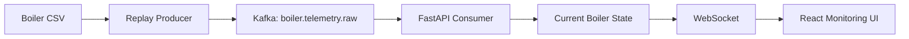

# BoilerOps Agent 프로젝트 계획

## 1. 프로젝트 식별 정보

| 항목 | 값 |
| --- | --- |
| 프로젝트명 | BoilerOps Agent |
| 한줄 설명 | 한국중부발전 보일러 운전데이터를 실시간 스트림으로 재현하고, 모니터링·운전 분석·AI Agent·승인 기반 제어까지 단계적으로 검증하는 산업 운영 시스템 |
| 디렉토리명 | `boiler-ops-agent` |
| GitHub Repository | `boiler-ops-agent` |
| Frontend | React + TypeScript + Vite |
| Backend | FastAPI |
| Event Streaming | Apache Kafka |
| Browser Streaming | WebSocket |
| 원본 데이터 | `한국중부발전(주)_(AI 친화 데이터)분 단위 발전설비(보일러) 운전데이터_20250404.csv` |
| 데이터 제공기관 | 한국중부발전(주) |
| 데이터 출처 | 공공데이터포털 |

## 2. 프로젝트 목표

BoilerOps Agent는 정적인 분 단위 발전설비 데이터를 시간 순서대로 재생해 실시간 보일러 운전 환경을 구성한다.

첫 목표는 AI 기능이 아니다. CSV 한 행이 이벤트로 발행되고, Kafka와 FastAPI를 거쳐 WebSocket으로 React 화면에 전달되며, 사용자가 보일러 계통과 센서 값을 시간 순서대로 확인할 수 있는 상태를 먼저 만든다.

실시간 데이터 흐름과 보일러 도메인 모델이 검증된 뒤 운전 분석, Read-only AI Agent, 온도 예측·제어 권고, 승인 기반 Simulator 제어를 단계적으로 추가한다.

```text
Historical Boiler CSV
        ↓
Realtime Replay Producer
        ↓
Apache Kafka
        ↓
FastAPI Operations Backend
        ↓
WebSocket
        ↓
React Monitoring UI
        ↓
Operational Analysis
        ↓
AI Operations Agent
        ↓
Control Recommendation
        ↓
Human Approval
        ↓
Simulator Control
        ↓
Trace / Validation
```

## 3. 문제 정의

발전 보일러 운전데이터에는 출력, 급탄, 공기, 급수, 증기, 과열기, 재열기, 배기가스 등 많은 Tag가 동시에 존재한다. Raw CSV만으로는 값이 어느 계통에 속하는지, 목표값과 실제값이 어떻게 변하는지, 관련 제어값이 함께 어떻게 변했는지 파악하기 어렵다.

프로젝트는 세 문제를 순서대로 해결한다.

1. 정적 CSV를 검증 가능한 실시간 이벤트 흐름으로 변환한다.
2. Raw Tag를 보일러 설비·계통·센서 문맥으로 구조화해 화면에 표시한다.
3. 검증된 운영 데이터를 AI Agent가 Tool을 통해 조회하고, 쓰기 작업에는 승인 경계를 적용한다.

## 4. 데이터 사용 원칙

### 4.1 원본 파일

```text
한국중부발전(주)_(AI 친화 데이터)분 단위 발전설비(보일러) 운전데이터_20250404.csv
```

원본 파일은 저장소에 커밋하지 않는다.

```text
data/raw/*.csv
```

실행 환경에서는 환경 변수로 경로를 주입한다.

```text
BOILER_DATASET_PATH=
REPLAY_INTERVAL_MS=
KAFKA_BOOTSTRAP_SERVERS=
KAFKA_TOPIC=
```

### 4.2 검증 전 확정 금지 항목

원본 파일과 공식 메타데이터를 확인하기 전에는 값을 임의로 확정하지 않는다.

- 측정 단위
- 정상·주의·위험 임계값
- 실제 센서 장착 좌표
- DCS/PLC Tag ID
- 설비별 제어 허용 범위
- 고장 Label
- 온도 제어 인과관계

컬럼명으로 확인 가능한 위치는 논리 계통 위치로 사용한다. 실제 발전소 P&ID 또는 Instrument Index가 필요한 위치는 `unverified` 상태로 관리한다.

## 5. Phase 1 이벤트 계약

Phase 1에서는 CSV 원본 행을 그대로 브라우저로 전송하지 않는다. Replay Producer가 식별 가능한 Event Envelope를 생성한다.

```json
{
  "sequence": 1024,
  "source_time": "<CSV 원본 시각>",
  "emitted_at": "<Replay 발행 시각>",
  "measurements": {
    "<tag>": "<value>"
  }
}
```

필수 규칙:

- `sequence`는 Replay 시작점부터 단조 증가한다.
- `source_time`은 원본 데이터의 시간축을 보존한다.
- `emitted_at`은 Replay 시스템의 발행 시각이다.
- 결측값은 임의 숫자로 대체하지 않는다.
- 숫자 파싱 실패는 원본 값과 오류 정보를 추적 가능하게 남긴다.
- Phase 1 Kafka Topic은 순서 검증을 위해 단일 파티션으로 시작한다.

초기 Topic 이름:

```text
boiler.telemetry.raw
```

## 6. Phase 1 시스템 구조



책임 경계:

| 구성 | 책임 |
| --- | --- |
| Replay Producer | CSV 순차 읽기, Event Envelope 생성, 재생 속도 적용, Kafka 발행 |
| Kafka | Backend 내부 이벤트 전달, Producer와 Consumer 분리 |
| FastAPI Consumer | Kafka 이벤트 수신, 파싱, 최신 상태 관리 |
| WebSocket | 브라우저에 실시간 상태 전달, 연결·재연결 처리 |
| React | 현재값·계통도·센서·최근 이벤트 표시 |

## 7. 보일러 도메인 초기 분류

현재 제공된 컬럼명을 기준으로 논리 계통을 분류한다. 실제 설비의 물리 배치와 동일하다고 주장하지 않는다.

### Generation

- 실제 출력값
- 목표 발전량
- 총 주증기 유량
- 주증기 유량
- 터빈용 주증기 압력

### Fuel / Combustion

- 석탄 유량 제어
- 급탄기 A~F 요구값
- 급탄기 A~F 속도 평균값
- 산소 제어
- 산소농도 기반 보정 제어
- 총 공기 유량
- 2차공기 주제어
- 버너 기울기 관련 값

### Furnace / Waterwall

- 노내 상부 좌측부 튜브 헤더 출구 온도 평균값
- 노내 상부 우측부 튜브 헤더 출구 온도 평균값
- 노내 상부 전면부 튜브 헤더 출구 온도 평균값
- 노내 상부 루프 튜브 헤더 출구 온도 평균값
- 보일러 노 루프 튜브 금속 온도

### Feedwater / Economizer

- 절탄기 입구 급수 보정 유량
- 절탄기 입구 급수 압력 중간값
- 절탄기 입구 급수 온도 중간값
- 절탄기 헤더 출구 링크 온도 01/02
- 총 급수 보정 유량
- 급수 압력 중간값
- 급수 온도 중간값

### Superheater / Main Steam

- 과열기 계통 입·출구 온도
- 최종과열기 헤더 온도 평균값 A/B
- 최종과열기 출구 온도 평균값
- 주증기 압력 관련 값
- 과열기 스프레이 총 유량
- 과열저감기 스프레이 유량·밸브 개도

### Reheater

- 저온 재열기 압력
- 재열증기 과열저감기 입·출구 온도 A/B
- 최종재열기 입구 온도 관련 값
- 재열기 스프레이 유량
- 재열기 과열저감기 스프레이 밸브 개도
- 목표 재열기 온도

### Flue Gas / Environment

- 배기가스 산소 중간값 A/B
- 덕트용 불투명도 분석기 A/B
- 선택적 촉매 환원장치 A/B 배기가스 입구 온도
- 굴뚝용 질소산화물 분석기

## 8. Phase 계획

### Phase 1 — Realtime Boiler Monitoring

**목표**

CSV 한 행이 실시간 Event Pipeline을 통과해 React 화면에서 순서대로 갱신되는 전체 흐름을 완성한다.

**구현 범위**

- CSV 스키마 확인
- Replay Producer
- 재생 속도 환경 변수
- Kafka 단일 Topic·단일 Partition
- FastAPI Kafka Consumer
- 현재 Boiler State 관리
- WebSocket Endpoint
- React WebSocket 연결·재연결
- 대표 KPI
- 논리 보일러 계통도
- 검증 가능한 Sensor Pin
- Live Telemetry 목록
- 연결 상태 표시

**대표 KPI 초기 후보**

- 실제 출력값
- 목표 발전량
- 총 주증기 유량
- 터빈용 주증기 압력
- 최종과열기 출구 온도 평균값
- 배기가스 산소 중간값
- 과열기 스프레이 총 유량
- 굴뚝용 질소산화물 분석기

단위는 데이터 정의 확인 후 표시한다.

**완료 기준**

- CSV Row 순서와 Kafka Event `sequence`가 일치한다.
- FastAPI가 Kafka Event를 순서대로 소비한다.
- React가 WebSocket Message 수신 시 현재값을 갱신한다.
- 보일러 계통도에 연결된 대표 Sensor 값이 갱신된다.
- Live Telemetry에서 최근 Event 순서를 확인할 수 있다.
- Kafka·WebSocket 연결 상태를 화면에서 확인할 수 있다.
- WebSocket 연결 종료 후 재연결이 가능하다.
- E2E 실행 결과로 재현 가능한 검증 아티팩트가 생성된다.

**Phase 1 제외 범위**

- AI Agent
- 온도 예측 모델
- 이상 탐지 모델
- 자동제어
- Write Tool
- Human Approval
- 실제 발전설비 연결
- 임의 정상·위험 임계값

### Phase 2 — Boiler Domain & Sensor Mapping

**목표**

Raw CSV Column을 설비·계통·측정값 문맥으로 구조화한다.

**구현 범위**

- Tag Registry
- Equipment Hierarchy
- Sensor → Equipment Mapping
- Sensor → UI Position Mapping
- 공식 근거가 확인된 Unit 반영
- Measurement / Control / Target 구분
- Mapping Confidence 관리
- 센서 선택 시 최근 Trend 표시

**완료 기준**

- 화면에 표시하는 모든 Tag가 Registry에 등록된다.
- 센서 위치마다 위치 근거 또는 `unverified` 상태가 존재한다.
- 원본 CSV Column과 화면 Sensor 간 역추적이 가능하다.

### Phase 3 — Operational Monitoring

**목표**

실시간 값 표시를 운전 상태 비교와 변화 추적이 가능한 모니터링으로 확장한다.

**구현 범위**

- Actual vs Target
- 최근 Trend
- 변화율
- Historical Distribution 기반 Deviation
- 관련 제어값 비교
- 과열기 또는 재열기 중 첫 분석 Loop 선택

**완료 기준**

- 선택한 Loop의 목표값·실제값·관련 입력값을 동일 시간축에서 비교할 수 있다.
- 공식 기준 없는 임계값을 안전 기준으로 표현하지 않는다.

### Phase 4 — Read-only AI Operations Agent

**목표**

AI Agent가 Raw CSV를 직접 읽지 않고 FastAPI의 검증된 Read Tool만 사용해 운전 상태를 설명하도록 구성한다.

**Tool 후보**

```text
get_boiler_status
get_equipment_status
get_sensor_history
get_operating_targets
get_current_controls
get_deviation_summary
```

**완료 기준**

- Agent의 모든 수치 근거가 Tool Result로 추적된다.
- 존재하지 않는 Tag를 근거로 사용하지 않는다.
- Write 기능이 존재하지 않는다.
- Tool 호출과 응답 Trace를 검증할 수 있다.

### Phase 5 — Temperature Forecast & Control Advisory

**목표**

선택한 온도 Loop의 미래 상태를 예측하고 운전 권고의 근거로 사용한다.

**진행 순서**

1. 예측 대상과 Forecast Horizon 확정
2. Naive Baseline 측정
3. 학습 모델 적용
4. MAE·RMSE 비교
5. Agent가 예측 결과를 Read Tool로 조회
6. 자동제어가 아닌 Control Advisory 제공

**제약**

관측 데이터에서 확인된 상관관계를 제어 인과관계로 단정하지 않는다.

### Phase 6 — Controlled Simulator Write

**목표**

Agent의 제어 제안을 승인된 Simulator 환경에서만 실행한다.

```text
Agent Recommendation
        ↓
Constraint Validation
        ↓
Human Approval
        ↓
Simulator Write
        ↓
Result / Trace
```

**원칙**

- Read Tool은 정책 범위 안에서 자동 실행 가능
- Write Tool은 Human Approval 필수
- 실제 발전설비 제어 연결 금지
- 요청값·기존값·승인자 판단·실행 결과·Trace 기록
- 승인 거절 후 실행 금지

### Phase 7 — Integrated E2E Validation

**목표**

전체 시스템의 실패 경로와 운영 경계를 E2E로 검증한다.

**검증 범위**

- Kafka 중단·복구
- WebSocket 중단·재연결
- CSV 결측·파싱 실패
- Event 순서 위반 감지
- Tag Mapping 오류
- Agent Tool 실패
- 승인 없는 Write 차단
- 승인 거절 후 미실행
- Write Trace 기록

**완료 기준**

```text
Unauthorized Write = 0
Approval Bypass = 0
Rejected Write Execution = 0
Successful Write Trace Coverage = 100%
```

## 9. 화면 설계 원칙

Phase 1 화면 세부 기준은 `DESIGN.md`를 따른다.

보일러 화면은 실제 발전소 P&ID 복제가 아니라 **운전 데이터 이해를 위한 논리 계통도**다. 일반 보일러 구조 공개자료는 계통 관계 참고에만 사용한다.

센서 위치 신뢰도:

| 상태 | 의미 |
| --- | --- |
| `verified-by-tag` | 컬럼명에서 계통·입구·출구·A/B 위치를 직접 확인 가능 |
| `logical-group` | 계통은 확인되지만 실제 계측기 위치는 확인 불가 |
| `unverified` | 공개 정보만으로 위치를 결정할 수 없음 |

## 10. 테스트 및 검증 전략

프로젝트 공통 테스트 규칙은 `AGENTS.md`가 최종 기준이다.

각 Phase는 기능 구현보다 사용자 관점의 전체 흐름을 E2E로 검증한다.

Phase 1 E2E 최소 시나리오:

```text
CSV 입력
→ Replay Event 발행
→ Kafka 수신
→ FastAPI 상태 갱신
→ WebSocket 전달
→ React 화면 값 변경
→ 검증 아티팩트 생성
```

아티팩트 예:

```text
artifacts/e2e/phase1/
├─ run.json
├─ telemetry.jsonl
└─ dashboard.png
```

아티팩트에는 실행 입력, 수신 Sequence, 최종 UI 상태를 다시 확인할 수 있는 정보가 포함되어야 한다.

## 11. 문서 체계

```text
.project/plan.md
AGENTS.md
DESIGN.md
docs/instructions/phaseN-*.md
docs/results/phaseN-*.md
README.md
```

역할:

| 문서 | 역할 |
| --- | --- |
| `.project/plan.md` | 프로젝트 전체 범위와 Phase 경계 |
| `AGENTS.md` | 저장소 전체 작업 규칙 |
| `DESIGN.md` | 현재 UI 구현 기준 |
| `docs/instructions/*` | 현재 Phase 작업 범위와 완료 기준 |
| `docs/results/*` | 실제 구현·검증 결과 |
| `README.md` | 사람을 위한 프로젝트 설명과 현재 상태 |

구현되지 않은 기능은 결과 문서나 README에서 완료된 기능처럼 표현하지 않는다.

## 12. 초기 디렉토리 구조

```text
boiler-ops-agent/
├─ .project/
│  └─ plan.md
├─ frontend/
├─ backend/
│  ├─ app/
│  │  ├─ api/
│  │  ├─ domain/
│  │  ├─ replay/
│  │  ├─ streaming/
│  │  └─ websocket/
│  └─ tests/
├─ data/
│  └─ raw/
├─ docs/
│  ├─ instructions/
│  └─ results/
├─ artifacts/
│  └─ e2e/
├─ AGENTS.md
├─ DESIGN.md
├─ README.md
├─ docker-compose.yml
├─ .env.example
└─ .gitignore
```

구체적인 라이브러리·패키지·저장소 구조는 해당 Phase에서 필요한 시점에 확정한다.

## 13. 품질 기준

```text
현실 데이터
→ 요구사항 정의
→ 구현
→ E2E 검증
→ Domain Validation
→ Human Review
→ 승인
→ 회귀 검증
```

품질 판단 기준:

- 데이터가 원본에서 UI까지 추적 가능한가
- 원본 순서와 화면 순서가 검증 가능한가
- 화면의 센서 위치에 근거가 있는가
- 임의 단위·임계값·설비 정보를 만들지 않았는가
- Agent 판단 근거가 Tool Result로 추적 가능한가
- 쓰기 경계가 읽기 경계보다 강하게 통제되는가
- 실패 결과를 재현할 수 있는 Trace와 E2E 아티팩트가 남는가

## 14. 참고 자료

- 공공데이터포털: https://www.data.go.kr/
- Apache Kafka Introduction: https://kafka.apache.org/intro/
- FastAPI WebSockets: https://fastapi.tiangolo.com/advanced/websockets/
- React `useEffect`: https://react.dev/reference/react/useEffect
- Babcock & Wilcox Radiant Boiler 구조 참고: https://www.babcock.com/assets/PDF-Downloads/Steam-Generation/E101-3193-RB-Boiler-Babcock-Wilcox.pdf

Babcock & Wilcox 자료는 실제 한국중부발전 대상 설비의 설계도 또는 P&ID가 아니다. Furnace, Superheater, Reheater, Economizer, SCR, Coal Feeder 등 일반적인 논리 계통 구성 참고에만 사용한다.
