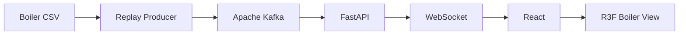

# BoilerOps Agent

> 한국중부발전 보일러 운전데이터를 실시간 Stream으로 재현하고, 2.5D 보일러 모니터링부터 AI 기반 운전 지원과 승인 제어까지 단계적으로 검증하는 산업 운영 시스템

## 프로젝트 정보

| 항목 | 값 |
| --- | --- |
| 프로젝트명 | **BoilerOps Agent** |
| 디렉토리명 | `boiler-ops-agent` |
| GitHub Repository | `boiler-ops-agent` |
| Frontend | React + TypeScript + Vite + React Three Fiber |
| Backend | FastAPI |
| Streaming | Apache Kafka + WebSocket |
| 데이터 제공기관 | 한국중부발전(주) |
| 데이터 출처 | 공공데이터포털 |
| 현재 구현 대상 | **Phase 1 — Realtime Boiler Monitoring** |

## 현재 상태

**기획 완료 / 구현 전**

Phase 1에서는 실시간 데이터 Pipeline과 Monitoring UI만 구현한다.

AI Agent, 온도 예측, Control Advisory, Write Tool, Human Approval은 현재 구현 범위가 아니다.

## 사용 데이터

```text
한국중부발전(주)_(AI 친화 데이터)분 단위 발전설비(보일러) 운전데이터_20250404.csv
```

분 단위 운전데이터의 발전량, 급탄, 공기, 급수, 증기, 과열기, 재열기, 배기가스 관련 Tag를 사용한다.

원본 CSV는 저장소에 포함하지 않는다.

```text
data/raw/*.csv
```

## Phase 1

정적인 CSV를 시간 순서대로 재생하고 Kafka와 FastAPI를 거쳐 WebSocket으로 React 화면에 전달한다.

```text
Boiler CSV
    ↓
Replay Producer
    ↓
Apache Kafka
    ↓
FastAPI
    ↓
WebSocket
    ↓
React
    ↓
React Three Fiber Boiler View
```

화면의 중심은 일반 Dashboard가 아니라 **고정형 2.5D Isometric Boiler Operations View**다.

```text
Plant Overview
→ Equipment
→ Sensor
→ Current Value / Trend
```

3D는 장식이 아니라 설비와 Sensor의 논리 위치를 이해하기 위한 Navigation Layer로 사용한다.

### Phase 1 화면

- Streaming / Kafka / WebSocket 상태
- Source Time
- Event Sequence
- 실제 출력값 / 목표 발전량
- 주증기 유량·압력
- 과열기 대표 온도
- 급수·연소·배기가스 대표값
- Isometric Boiler Scene
- 검증 가능한 Sensor Marker
- Equipment / Sensor Inspector
- Live Operations Feed
- Stale / Error / Reconnect 상태

## 보일러 화면 원칙

화면의 보일러 구조는 실제 발전소 P&ID 복제가 아니다.

현재 데이터 Column과 공개된 일반 보일러 구조자료를 이용해 논리 계통을 구성한다.

```text
Coal Feeder
    ↓
Combustion / Furnace
    ↓
Superheater / Reheater
    ↓
Economizer
    ↓
SCR / Flue Gas
    ↓
Stack
```

실제 센서 장착 좌표가 확인되지 않은 Tag는 위치를 임의 생성하지 않는다.

3D Camera는 고정 Isometric 시점을 기본으로 한다.

Phase 1에서 자유 회전, 1인칭 이동, 과도한 Animation은 사용하지 않는다.

## 시스템 구조



Kafka는 서비스 내부 Streaming, WebSocket은 브라우저 Realtime Delivery를 담당한다.

Phase 1에서는 순서 검증을 우선해 `boiler.telemetry.raw`를 단일 Partition으로 시작한다.

## Phase Roadmap

| Phase | 목표 | 상태 |
| --- | --- | --- |
| 1 | Realtime Pipeline + 2.5D Boiler Monitoring | 예정 |
| 2 | Boiler Domain / Sensor Mapping 확장 | 예정 |
| 3 | Trend / Target / Deviation 기반 Operational Monitoring | 예정 |
| 4 | Read-only AI Operations Agent | 예정 |
| 5 | Temperature Forecast / Control Advisory | 예정 |
| 6 | Human Approval 기반 Simulator Write | 예정 |
| 7 | E2E / 실패 경로 / Trace 검증 | 예정 |

각 Phase 범위는 `.project/plan.md`와 `docs/instructions/phaseN-*.md`에서 관리한다.

## 프로젝트 구조

```text
boiler-ops-agent/
├─ .project/
│  └─ plan.md
├─ frontend/
├─ backend/
├─ data/
│  └─ raw/
├─ docs/
│  ├─ instructions/
│  └─ results/
├─ AGENTS.md
├─ DESIGN.md
├─ README.md
└─ .gitignore
```

## 문서 역할

```text
.project/plan.md          전체 기획과 Phase 경계
AGENTS.md                 저장소 작업 규칙
DESIGN.md                 현재 UI 설계 기준
docs/instructions/        Phase별 구현 지침
docs/results/             실제 구현·검증 결과
README.md                 현재 프로젝트 상태
```

구현되지 않은 기능을 완료된 기능처럼 표현하지 않는다.

## 데이터 처리 원칙

- 원본 시간축 보존
- Replay 발행 시각 별도 기록
- Event `sequence` 단조 증가
- 결측값 임의 보정 금지
- 단위 추측 금지
- 정상·위험 Threshold 임의 생성 금지
- 실제 센서 위치 추측 금지
- 실제 발전설비 Write 연결 금지

## 테스트

테스트 기준은 `AGENTS.md`를 따른다.

Phase 완료 여부는 단위 테스트 수가 아니라 **실제 사용자 흐름을 통과하는 E2E와 검증 가능한 아티팩트**로 판단한다.

Phase 1 E2E 경로:

```text
CSV
→ Kafka
→ FastAPI
→ WebSocket
→ React
→ R3F Sensor / KPI / Operations Feed
```

## 참고 자료

- React Three Fiber: https://r3f.docs.pmnd.rs/
- React Three Fiber Canvas: https://r3f.docs.pmnd.rs/api/canvas
- Apache Kafka: https://kafka.apache.org/
- FastAPI WebSockets: https://fastapi.tiangolo.com/advanced/websockets/
- React: https://react.dev/
- Babcock & Wilcox Radiant Boiler: https://www.babcock.com/assets/PDF-Downloads/Steam-Generation/E101-3193-RB-Boiler-Babcock-Wilcox.pdf

Babcock & Wilcox 자료는 대상 발전설비의 실제 도면이 아니다. 일반적인 보일러 계통 관계를 이해하기 위한 참고자료로만 사용한다.
