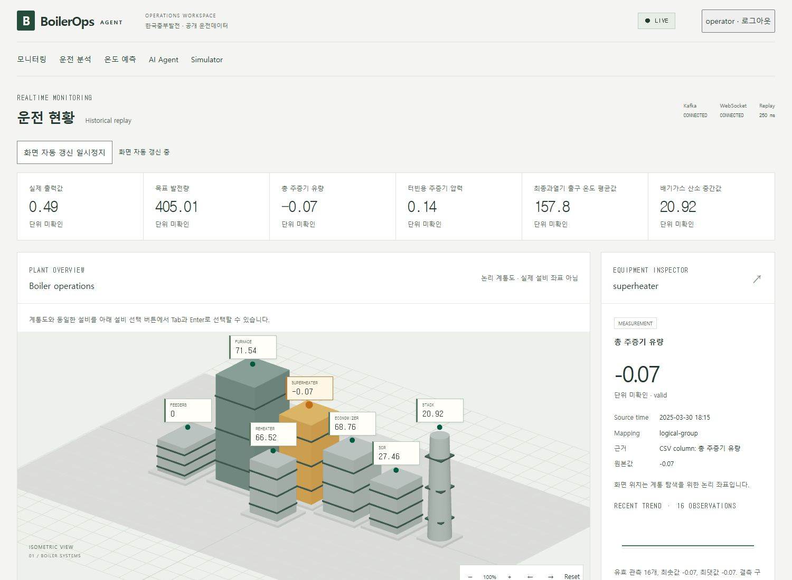
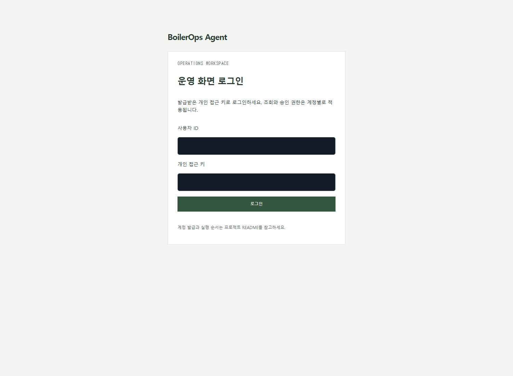
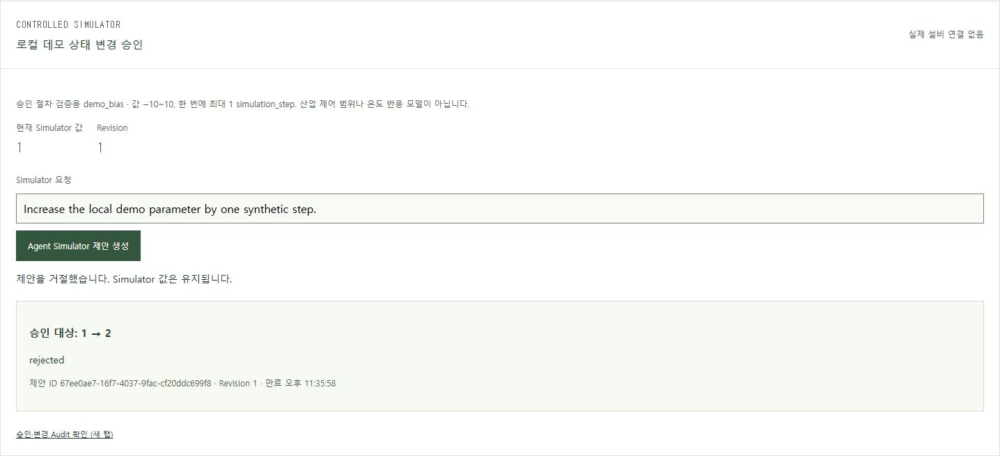

# BoilerOps Agent

보일러의 과거 운전 데이터를 재생하면서 **센서 값, 온도 변화, AI 답변과 5분 뒤 예측**을 확인하는 로컬 앱입니다. 변경 승인은 연습용 Simulator에서만 실행하며, 실제 발전설비를 제어하지 않습니다.

[그림으로 보는 프로젝트 지도](https://seoheejung.github.io/boiler-ops-agent/)에서 기능과 코드 구조를 볼 수 있습니다. 이 링크는 **설명 페이지**이며, 실제 앱은 아래 방법으로 실행합니다.

## 실행은 이렇게 하세요

### 처음 한 번 준비

- **Node.js 22.12 이상, Python 3.13, uv, Docker Desktop, Ollama**가 필요합니다. 이미 설치했다면 다시 설치하지 않아도 됩니다. [설치 확인 방법](docs/local-development.md)
- 원본 **CSV 파일을 `data/raw/` 폴더에 넣습니다.** CSV는 저장소에 포함되어 있지 않습니다. 기존 `.env`가 있으면 그 파일에 지정된 경로를 사용합니다.

### 실행

**Docker Desktop을 켜고**, 엔진이 준비될 때까지 기다립니다. 이 README와 `package.json`이 있는 프로젝트 폴더에서 PowerShell을 열고 실행하세요.

```powershell
npm start
```

서버와 데이터 재생이 자동으로 시작되고 브라우저가 열립니다. 브라우저가 안 열리면 **http://127.0.0.1:5173**으로 접속합니다. 처음에는 설치와 모델 준비에 시간이 걸리며, 기본 AI 모델이 없으면 약 4.7GB를 다운로드합니다.

### 로그인과 종료

| 로그인 항목 | 입력할 값 |
| --- | --- |
| 사용자 ID | `operator` |
| 개인 접근 키 | 터미널에 표시된 `operator`의 `Access key:` 뒤의 값 |

**개인 접근 키는 최초 발급하거나 재발급할 때만 표시됩니다.** 평소 `npm start`로 시작하면 기존 키를 사용합니다. 키를 받은 적이 없거나 보관하지 못했다면 바로 아래의 재발급 명령을 사용하세요.

화면의 숫자와 시간이 바뀌면 실행된 것입니다. **종료는 실행한 PowerShell 창에서 Enter**를 누르면 됩니다. 다음에 볼 때도 `npm start`를 실행하세요.

## 개인 접근 키를 모를 때

실행 중인 PowerShell 창에서 **Enter로 앱을 종료**한 뒤, 같은 폴더에서 실행하세요.

```powershell
npm run start:reset-key
```

`operator`의 새 키를 발급하고 앱을 다시 시작합니다. 터미널에 나온 **`Access key:` 뒤의 긴 문자열만 복사**해서 로그인 화면의 개인 접근 키에 붙여넣으세요. 새 키는 안전하게 보관하세요.

이전 operator 키는 더 이상 사용할 수 없습니다. Kafka 설정과 다른 사용자, 기존 조회·승인 기록은 유지됩니다. **`.env.security` 파일을 삭제할 필요가 없습니다.**

## 실행이 안 될 때

| 증상 | 확인할 것 |
| --- | --- |
| `npm` 또는 `uv` 명령을 찾지 못함 | 도구 설치 후 PowerShell을 새로 열기 |
| Docker 연결 실패 | Docker Desktop과 엔진이 준비됐는지 확인 |
| 원본 CSV가 없다는 안내 | `data/raw/`의 파일과 기존 `.env`의 경로 확인 |
| 포트를 사용 중이라는 안내 | 전에 실행한 이 프로젝트를 종료하고 다시 시작 |
| 그 밖의 오류 | 터미널에 표시된 실패 단계와 로그 위치 확인 |

자세한 확인 방법은 [문제 해결 안내](docs/local-development.md)에 있습니다. 설정 파일이나 키를 공유하지 마세요.

## 화면에서 할 수 있는 것

- **센서 탐색:** 설비를 선택하고 현재값·원본 시각·이력을 확인합니다.
- **AI 질문:** 현재값과 온도 변화 등을 질문하고 답변의 근거와 한계를 확인합니다.
- **온도 예측:** 5분 뒤 예측값과 실제 시험 성능을 비교합니다.
- **승인 연습:** 연습용 변경안을 검토하고 승인·거절 결과를 확인합니다.



| 로그인 | 연습용 변경 승인 |
| --- | --- |
|  |  |

## 알아둘 점

- 현재 시각의 설비 데이터가 아니라 **2025년 3~4월의 과거 CSV**를 재생합니다.
- 목표 온도, 측정 단위, 실제 설비 위치와 안전 기준은 미확인입니다. 값을 임의로 만들지 않습니다.
- 현재 온도 예측 모델은 시험에서 단순 기준 모델보다 오차가 컸습니다. 실제 운전 판단에 사용할 수 없습니다.
- `npm start`로 실행한 화면은 코드 수정 후 **종료하고 다시 실행**하면 반영됩니다. 저장 즉시 반영하는 개발 서버는 [수동 개발 안내](docs/local-development.md)를 참고하세요.

## 더 자세히 보기

| 보고 싶은 내용 | 문서 |
| --- | --- |
| 기능 흐름·코드 지도·구현 전 설계 | [그림으로 보는 프로젝트 지도](https://seoheejung.github.io/boiler-ops-agent/) |
| 개발 서버를 따로 실행하는 방법 | [수동 개발 안내](docs/local-development.md) |
| 실제 실행과 검수 결과 | [실행 검증](docs/results/phase7-local-start.md) · [질문별 답변](docs/results/phase7-agent-answers.md) |
| 접근성·보안 점검 | [접근성 검수](docs/results/phase7-ui-accessibility-review.md) · [보안 보완 결과](docs/results/phase7-security-hardening.md) |
| 프로젝트 범위·화면 설계 | [프로젝트 계획](.project/plan.md) · [UI 설계](DESIGN.md) |
