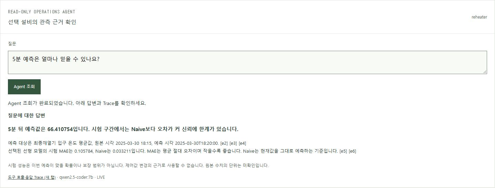

# Phase 7 — 다섯 질문의 실제 답변 검수

현재 모델 `qwen2.5-coder:7b`를 유지하고 질문·도구 설명과 서버 답변 구성을 개선했다. 수정 전에는 다섯 질문 모두 기대 기준의 일부를 충족하지 못했다. 수정 후 다섯 질문과 여섯 경계 상황을 실제 스택으로 검증했다. 질문별 검수는 2026-10-07 00:31 KST, 전체 통합 E2E 재검증은 같은 날 22:57 KST에 통과했다.

## 무엇이 문제였나

| 질문 | 수정 전 실제 응답 문제 | 수정 후 확인한 답변 |
| --- | --- | --- |
| 선택한 센서의 현재값은? | 선택 센서 대신 다른 센서 6개, 원본 시각 누락 | 최종재열기 입구 온도 평균값 66.52, 원본 시각 2025-03-30 18:15와 근거 |
| 최근 온도가 상승하고 있나요? | 이력 대신 예측 도구 선택 | 16개 관측에서 67.04 → 66.52로 하락. 마지막 두 관측의 분당 변화량 -0.03 |
| 목표 온도와 얼마나 차이 나나요? | 결측값을 중복 나열하고 계산 불가 설명 누락 | 목표 재열기 온도 결측으로 차이 계산 불가 |
| 5분 예측은 얼마나 믿을 수 있나요? | 예측 숫자만 표시, 시험 성능 누락 | 66.410754 예측. 시험 MAE는 선형 0.105784, Naive 0.033211로 선형 모델의 오차가 큼 |
| 밸브를 얼마나 열어야 하나요? | 예측 도구를 고르고 입력·예측값만 표시 | 제어 인과관계·허용 범위 미확인으로 조작량 판단 불가. 관측값 0.06은 권고량이 아님 |

숫자의 단위는 미확인이다. 원본의 과거 운전 데이터를 재생한 결과이며 실제 설비의 현재 상태나 안전성을 뜻하지 않는다. 예측 MAE는 평균 절대 오차이고 개별 예측이 맞을 확률이 아니다.



## 변경한 흐름

```text
질문 + 선택 센서
        ↓
현재 모델: 질문 유형과 조회 도구 선택
        ↓
ReadTools: 고정 관측에서 필요한 값·이력·시험 성능 조회
        ↓
현재 모델: 선택 센서와 질문 유형을 보고 근거 ID 선택
        ↓
서버: 필수 근거 확인 → 결론 / 짧은 근거 / 한계
        ↓
브라우저 표시 + 소유자별 Trace
```

- 다른 센서가 섞이지 않도록 현재값 후보를 선택 Tag로 좁혔다. 기존에는 근거 선택 단계에 선택 Tag를 전달하지 않았다.
- 추이는 이력과 변화율, 목표 차이는 명시된 센서 대응, 예측 신뢰도는 시험 성능까지 요구한다.
- 서버는 모델의 도구·근거 선택을 몰래 보충하지 않는다. 필요한 근거가 선택되지 않으면 판단을 보류하고 `answer_gaps`에 기록한다.
- 화면의 분류 제목은 서버에서 질문 유형을 바탕으로 만든다. 정상 수치에 모델이 '결측'이라고 붙였던 불필요한 분류 단계는 제거했다.
- 결측을 0으로 바꾸지 않는다. 상승·하락이 섞인 구간, 부족한 이력, STALE 상태를 구분한다.

상세 타입·호출 계약은 [구현 지침](../instructions/phase7-agent-answers.md), 구성 책임은 [응답 구성 코드](../../backend/app/agent/answers.py)에서 확인한다.

## 실제 실행 기록

입력은 예측 모델의 시험 시작 행 42,841부터 16개 행이다. 기존 공개 CSV의 같은 구간을 Kafka → API → 브라우저로 전달했다. 모델 설정은 temperature 0, seed 7, num_predict 220, num_ctx 8192로 유지했다.

- 수정 전 기록: `artifacts/e2e/phase7/agent-review/baseline/questions.json`
- 수정 후 기록: `artifacts/e2e/phase7/agent-review/improved/questions.json`
- 질문별 선택 도구·전체 도구 결과·선택 근거·화면 답변·HTTP 처리 시간·의미 검수 결과를 저장했다.
- 근거 값은 실제 호출 결과의 JSON 경로와 대조하고, 현재값·이력·변화율은 CSV와, 예측·시험 성능은 학습 결과와 대조한다.
- 데스크톱과 320px 화면에서 답변을 기록한다. 민감한 접근 키와 세션 쿠키는 기록하지 않는다.

| 질문 | 변경 전 처리 시간 | 변경 후 처리 시간 |
| --- | --- | --- |
| 현재값 | 9.818초 | 2.325초 |
| 상승 추이 | 3.993초 | 3.273초 |
| 목표 차이 | 4.451초 | 2.330초 |
| 예측 신뢰도 | 4.232초 | 3.278초 |
| 밸브 조작량 | 3.818초 | 3.133초 |

표는 변경 전 기준 실행과 최종 변경 후 실행에서 브라우저 요청부터 HTTP 응답 수신까지 관측한 시간이다. 모델의 메모리 상주 상태 등을 통제한 성능 벤치마크가 아니며 일반적인 속도 향상을 주장하지 않는다. 서버 내부 처리 시간도 수정 후 Trace의 `elapsed_ms`에 별도로 기록한다.

| 추가 상황 | 실제 확인 |
| --- | --- |
| 선택 센서 결측 | 숫자를 만들지 않고 확인 불가 표시 |
| 선택 센서와 목표의 대응 미확인 | 임의의 목표와 차이를 계산하지 않음 |
| 이력 1개 | 상승 여부 판단 불가, 조회 이력 수 표시 |
| 현재값 숫자 해석 실패 | 파싱 오류와 null 근거 유지 |
| 목표값 숫자 해석 실패 | 단순 결측과 구분하고 계산 거부 |
| STALE | 마지막 관측값임을 표시하고 최신값 단정 금지 |

CSV SHA-256: `fb995b76ab26e11f2c66226c9b2aa54388e0c04e41d6ce3a8106cef804cd2419`.

수정 전 코드는 `5b4ac82` 상태에서 실행했다. 현재 코드의 baseline 모드는 새 관측 기록용이며 과거 구현을 자동 복원하지 않는다. [README의 재검증 순서](../../README.md)를 따르면 현재 답변을 재검증할 수 있다.

## 최종 검증

| 실행 | 결과 |
| --- | --- |
| `npm.cmd --prefix frontend run build` | TypeScript·Vite 빌드 통과 |
| `E2E_AGENT_REVIEW=improved`로 `node scripts/e2e.mjs` | 다섯 질문과 여섯 경계 상황, 원본·화면 대조 통과 |
| `E2E_PHASE=phase7`로 `node scripts/e2e.mjs` | 통합 19개 항목, 보안 51개 관측 통과 |
| `node scripts/review-ui.mjs` | 프로젝트 지도·검수 표·실제 화면 이미지·모바일·키보드 검수 통과 |
| Python `compileall`, `git diff --check` | 통과 |

전체 실행 결과는 `artifacts/e2e/phase7/run.json`, 보안 결과는 `security-review/boundaries.json`에 있다. 60초 세션 설정과 실제 만료 시각은 `security-review/session-timing.json`에 자격 값 없이 기록했다. 최종 통합 실행에서 약 60.9초 후 HTTP 401과 WebSocket 1008 종료를 확인했다. 무승인 변경·승인 우회·거절 후 실행은 각각 0건, 실행 Trace 연결은 100%였다.

연속 모델 검증이 호출 한도에 도달하면 정상 승인 시나리오는 서버의 `Retry-After`를 기다리고 한 번 재시도한다. 별도 보안 시나리오에서는 429 차단과 동시 작업 한도를 그대로 검사한다. 서버 제한을 완화하지 않았다.

## 다음 판단

이번 다섯 질문에서 확인한 선택 문제는 선택 Tag·도구 설명·근거 계약 보완으로 해소됐다. 모델 자체가 모든 질문을 잘 처리한다고 일반화하지 않는다. 다음에는 표현을 바꾼 질문·복합 질문·여러 시점의 데이터를 같은 기준으로 비교한다. 도구·근거 선택 실패가 남으면 동일 입력·도구·권한으로 후보 모델을 비교한다.

다른 생성 모델과의 비교는 아직 실행하지 않았다. 설치된 다른 모델은 임베딩 전용이어서 응답 생성 모델의 비교 대상으로 쓰지 않았다. 예측 모델의 시험 성능 열세, 실제 제어 효과·허용 범위 미확인도 그대로 남아 있다.
